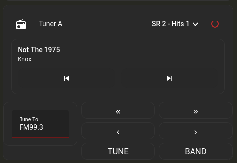

# nuvo_tuner
Home Assistant custom component integration to control Nuvo tuners (currently only the NV-T2SIR).

## What this Integration does:

Creates Home Assistant Entities for each tuner allowing control through Home Assistant.

This integration is capable of reading the NV-T2SIR configuration and setting your favorites and presets as sources.  You must configure the presets on the main screen or through the Nuvo tuner configuration program.  Unfortunately there is no way to save them over the RS232 interface.  If you have presets marked as favorites, they will appear first.  If you have the Sirius option installed, all Sirius channels will be listed below the presets as sources.  The Sirius radio must be powered up for 3 minutes before a channel download will begin.  Afterwards, the integration will rescan the channel list every 24 hours and rebuild the source list.

Since Home Assistant was not really designed with a tuner like this in mind, there are a few things that had to be improvised for better control, therefore the service <b>media_player.play_media</b> is used for issuing commands or direct tuning of stations.  The following commands are processed:

* station/channel numer - directly goes to that freq/channel, you can also put in the band as well if is not on the correct band already, such as FM99.3 or SR1
* SEEK-/SEEK+ - same as pressing the seek buttons
* TUNE-/TUNE+ - same as pressing the tuning buttons
* PRESET-/PRESET+ - same as pressing the preset buttons
* BAND - same as pressing the BAND button
* RELOAD - Reloads all configuration and channels
* AM - Tunes to the AM band
* FM - Tunes to the FM band
* SR - Tunes to the Sirius band

## Known issues:

Warning in the logs from Home Assistant: "Detected blocking call to sleep inside the event loop."  I know this is due to the fact the serial port is used, but have not researched in further.  In my experience this does not cause any problems, and this generally only when the main configuration is read.

## Connecting to the Nuvo:
Connection to the Nuvo is by an RS232 serial port from the host running Home Assistant to the tuner's serial port, either by using a USB to RS232 converter, or by using a RS232 port directly on the host.  If using a USB to RS232 converter, I would recommend using the full name instead of "/dev/ttyUSB0" as if you have more than one serial port that device can change.  You can find the full name by looking in /dev/serial/by-id.  For instance, "/dev/serial/by-id/usb-Prolific_Technology_Inc._USB-Serial_Controller_D-if00-port0".

## Installing:

[](https://github.com/hacs/integration)

Install using the Home Assistant Community Store [HACS](https://hacs.xyz).

Once HACS is installed, go to the Integrations page and select the menu in the upper right hand corner and choose "Custom Repositories."

In the repository field, enter: https://github.com/brmccrary/nuvo_tuner

In the Category field, select Integration. 

The integration will now show up as nuvo_tuner under integrations inside HACS.  Click on it and Download.
 
## Configuration:

Configuration must be done through configuration.yaml, no GUI option is available for now.

The only required configuration is just a port where the tuner can be accessed.
The track option gives 3 ways to set up the media track buttons.  They are:

* tune: Tune to the station one channel at a time
* seek: Seek to the next or previous station found
* preset: Go to the next or previous preset saved on the tuner

Example:
~~~
media_player:
  - platform: nuvo_tuner
    baud: 57600 # Optional (57600 is default)
    port: /dev/serial/by-id/usb-Prolific_Technology_Inc._USB-Serial_Controller_D-if00-port0
    track: preset # Optional, defaults to seek.  Can be one of tune, seek, or preset

~~~
## How to use when the serial port is on another machine:

You can use the program ncat, available on most Linux distros, as a way to access the Nuvo across the LAN if it's on a different machine.
Here is an example of how to set this up, using port 59001 as the connection port.  Feel free to change to meet your individual needs.

After installing ncat, create a file /usr/local/bin/nuvonet with the following, putting your actual serial port device in the PORT setting:
~~~
#!/bin/bash
export PORT=<your serial port goes here>
stty -F $PORT cs8 -cstopb -parenb -crtscts raw 57600
ncat --listen --keep-open 59001 < $PORT > $PORT
~~~
Make it executable by running:
~~~
chmod 755 /usr/local/bin/nuvonet
~~~
If using systemd, you can make it start automatically by making a file in /etc/systemd/system/nuvonet.service
~~~
# systemd configuration for nuvonet.service

[Unit]
Description=Nuvo Serial to Network
Requires=time-sync.target
After=time-sync.target

StartLimitIntervalSec=100
StartLimitBurst=5

[Service]
ExecStart=/usr/local/bin/nuvonet
ExecReload=/bin/kill -HUP $MAINPID
Type=simple

Restart=on-failure
RestartSec=60

[Install]
WantedBy=multi-user.target
~~~
Run the following to start the new "nuvonet" service:
~~~
systemctl enable nuvonet
systemctl start nuvonet
~~~
Change the port setting in configuration.yaml to:
~~~
port: socket://<yournuvohost>:59001
~~~

**IMPORTANT**  This has no security at all, so anyone could connect, in this case, to port 59001 and control your Nuvo.  Do not expose this port to the outside.  

## Troubleshooting:

Add the following to configuration.yaml to enable debugging:
~~~
logger:
  default: warn # Put your normal logging level that you use here.
  logs:
    custom_components.nuvo_tuner: debug
    nuvo_tuner: debug
~~~

## Lovelace Frontend Configuration
Everything in this section is optional and shows a heavily opinionated method of configuring Lovelace to display the tuner entities.  While it may not be to everyones taste, it should at least give some inspiration for configuration possibilites.

The core [Media Player](https://www.home-assistant.io/integrations/media_player/) integration (and therefore any Lovelace media control card representing a media player entity) does not provide a way to control some of the functions of the tuner.

While Home Assistant will auto-create Lovelace media control and number cards for each Nuvo tuner entity, a more polished look can be achieved using third-party cards [mini-media-player](https://github.com/kalkih/mini-media-player), installable through [HACS](https://hacs.xyz).

This example Lovelace configuration displays the extar tuner settings in a [Conditional](https://www.home-assistant.io/lovelace/conditional/) card that is only displayed when the tuner is switched on and an input_boolean entity is True.  This input_boolean is toggled by tapping the mini-media-player representing the tuner.  In order to achieve this, an additional input_boolean entity per tuner needs manually created (it's purely to control the frontend Conditional card, it doesn't represent anything on the Nuvo itself).

e.g. In configuration.yaml:

```yaml
input_boolean:
  tuner_a_extra_settings:
    name: Tuner A extra settings
    initial: off

  tuner_b_extra_settings:
    name: Tuner B extra settings
    initial: off

```

Will create the entities:
```
input_boolean.tuner_a_extra_settings
input_boolean.tuner_b_extra_settings
```

As shown the yaml section below, the [tap action](https://github.com/kalkih/mini-media-player#action-object-options) on each mini-media-player will call the input_boolean.toggle service.

Here is a Vertical Stack card configuration:
```yaml
type: vertical-stack
cards:
  - type: entities
    entities:
      - type: custom:mini-media-player
        entity: media_player.nuvo_tuner_a
        group: true
        source: full
        hide:
          controls: true
          volume: true
          info: true
          power_state: false
          play_pause: true
          prev: true
          next: true
        tap_action:
          action: call-service
          service: input_boolean.toggle
          service_data:
            entity_id: input_boolean.tuner_a_extra_settings
        icon: mdi:radio
        volume_stateless: true
        name: ' Tuner A'
      - type: custom:mushroom-media-player-card
        entity: media_player.nuvo_tuner_a
        icon: none
        use_media_info: true
        media_controls:
          - next
          - previous
        icon_type: none
        fill_container: false
        tap_action:
          action: call-service
          service: input_boolean.toggle
          data: {}
          target:
            entity_id: input_boolean.tuner_a_extra_settings
        hold_action:
          action: none
        double_tap_action:
          action: none
  - type: conditional
    conditions:
      - entity: media_player.nuvo_tuner_a
        state: playing
      - entity: input_boolean.tuner_a_extra_settings
        state: 'on'
    card:
      type: horizontal-stack
      cards:
        - type: vertical-stack
          cards:
            - type: entities
              entities:
                - entity: input_text.tuner_a_channel
                  type: custom:text-input-row
        - type: vertical-stack
          cards:
            - show_name: false
              show_icon: true
              type: button
              state_color: false
              tap_action:
                action: call-service
                service: media_player.play_media
                data:
                  media_content_type: '-'
                  media_content_id: seek-
                target:
                  entity_id: media_player.nuvo_tuner_a
              entity: media_player.nuvo_tuner_a
              icon: mdi:chevron-double-left
              icon_height: 20px
              show_state: false
            - show_name: false
              show_icon: true
              type: button
              tap_action:
                action: call-service
                service: media_player.play_media
                data:
                  media_content_type: '-'
                  media_content_id: tune-
                target:
                  entity_id: media_player.nuvo_tuner_a
              entity: media_player.nuvo_tuner_a
              icon: mdi:chevron-left
              icon_height: 20px
              state_color: false
            - show_name: true
              show_icon: false
              type: button
              tap_action:
                action: call-service
                service: script.tune_tuner_a_to_input_text
                data: {}
                target: {}
              entity: input_text.tuner_a_channel
              name: TUNE
        - type: vertical-stack
          cards:
            - show_name: false
              show_icon: true
              type: button
              tap_action:
                action: call-service
                service: media_player.play_media
                data:
                  media_content_type: '-'
                  media_content_id: seek+
                target:
                  entity_id: media_player.nuvo_tuner_a
              entity: media_player.nuvo_tuner_a
              icon: mdi:chevron-double-right
              icon_height: 20px
              state_color: false
            - show_name: false
              show_icon: true
              type: button
              tap_action:
                action: call-service
                service: media_player.play_media
                data:
                  media_content_type: '-'
                  media_content_id: tune+
                target:
                  entity_id: media_player.nuvo_tuner_a
              entity: media_player.nuvo_tuner_a
              icon: mdi:chevron-right
              icon_height: 20px
              state_color: false
            - show_name: true
              show_icon: false
              type: button
              tap_action:
                action: call-service
                service: media_player.play_media
                data:
                  media_content_type: '-'
                  media_content_id: BAND
                target:
                  entity_id: media_player.nuvo_tuner_a
              entity: media_player.nuvo_tuner_a
              name: BAND
```
This configuration will display the card below (except with your own theme, which is probably different than mine), with the extra tuner settings card toggled by tapping on the media player, in any area not containing a control:


